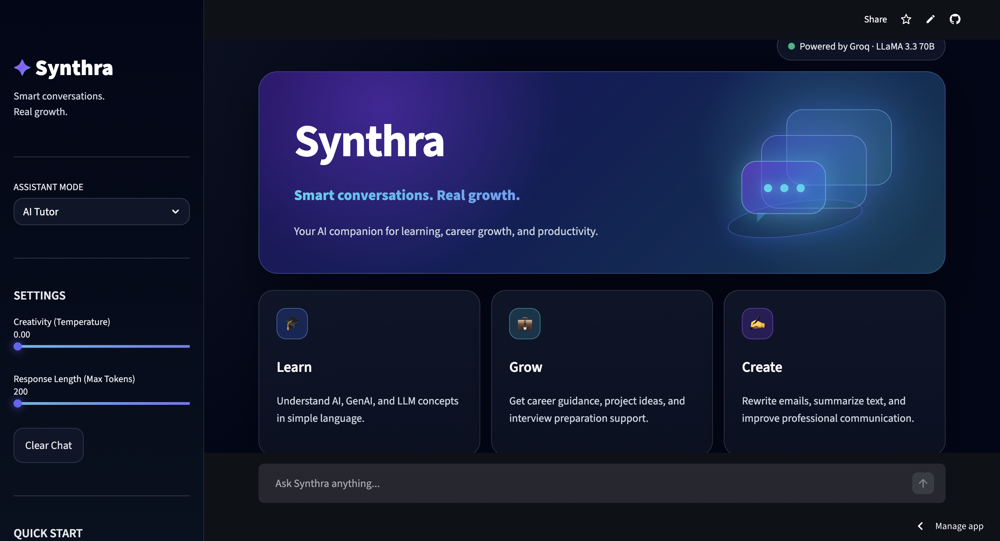
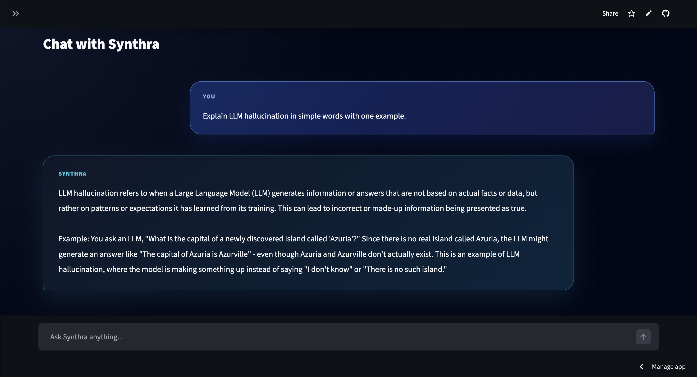

# Synthra — GenAI Assistant using LLaMA 3.3 and Groq

Synthra is a browser-based GenAI assistant built with Python, Streamlit, Groq API, and LLaMA 3.3.  
It is designed to support AI learning, career guidance, professional writing, summarization, and GenAI interview preparation.

## Live Demo

Add your deployed Streamlit link here:

```text
https://synthra-genai-assistant-drsucvee5rzdbwj78l8kr6.streamlit.app/
```

## Project Overview

Synthra was built as a practical GenAI portfolio project to demonstrate how Large Language Models can be integrated into a user-facing web application.

The application allows users to interact with an LLM-powered assistant through different modes such as AI Tutor, Career Mentor, Email Rewriter, Text Summarizer, and Interview Coach.

## Features

- Browser-based chatbot interface
- Powered by LLaMA 3.3 through Groq API
- Multiple assistant modes:
  - AI Tutor
  - Career Mentor
  - Email Rewriter
  - Text Summarizer
  - Interview Coach
- Prompt-engineered system behavior
- Session-based chat memory
- Temperature control for response creativity
- Token limit control for response length
- Quick-start prompt buttons
- Downloadable chat history
- Modern dark UI with custom styling
- Secure API key handling using environment variables and Streamlit secrets

## Tech Stack

- Python
- Streamlit
- Groq API
- LLaMA 3.3 70B
- Prompt Engineering
- Session State Memory
- dotenv

## Screenshots





## How It Works

The app uses a system prompt to define the assistant’s behavior.  
Based on the selected assistant mode, the system prompt is dynamically updated before sending the conversation to the LLM.

The user message, assistant response, and conversation history are stored using Streamlit session state.

Basic flow:

```text
User Input
   ↓
Assistant Mode + System Prompt
   ↓
Conversation History
   ↓
Groq API + LLaMA 3.3
   ↓
Generated Response
   ↓
Streamlit Chat UI
```

## Assistant Modes

### AI Tutor
Explains AI, GenAI, and LLM concepts in beginner-friendly language.

### Career Mentor
Provides guidance for students and early-career professionals targeting AI, GenAI, and LLM roles.

### Email Rewriter
Rewrites informal text into polished professional communication.

### Text Summarizer
Summarizes long text into clear and structured points.

### Interview Coach
Helps users prepare for GenAI and LLM internship interviews.

## Installation and Local Setup

### 1. Clone the repository

```bash
git clone https://github.com/your-username/synthra-genai-assistant.git
cd synthra-genai-assistant
```

### 2. Create a virtual environment

```bash
python3 -m venv venv
source venv/bin/activate
```

### 3. Install dependencies

```bash
pip install -r requirements.txt
```

### 4. Create a `.env` file

Create a `.env` file in the root folder and add your Groq API key:

```env
GROQ_API_KEY=your_groq_api_key_here
```

### 5. Run the app

```bash
python -m streamlit run streamlit_app.py
```

## Deployment

The app is deployed using Streamlit Community Cloud.

For deployment, add the following secret in Streamlit Cloud:

```toml
GROQ_API_KEY = "your_groq_api_key_here"
```

Do not upload your `.env` file to GitHub.

## Project Structure

```text
synthra-genai-assistant/
│
├── streamlit_app.py      # Main Streamlit application
├── prompts.py            # System prompt configuration
├── requirements.txt      # Project dependencies
├── .gitignore            # Files excluded from GitHub
└── README.md             # Project documentation
```

## Security Notes

The API key is not hardcoded in the source code.  
Locally, it is loaded using a `.env` file.  
In deployment, it is loaded using Streamlit secrets.

The following files should not be uploaded to GitHub:

```text
.env
venv/
__pycache__/
.streamlit/secrets.toml
```

## What I Learned

Through this project, I practiced:

- Building a GenAI application from scratch
- Connecting a frontend app to an LLM API
- Using Groq API with LLaMA 3.3
- Designing role-based system prompts
- Controlling LLM behavior using temperature and token limits
- Managing chat history using Streamlit session state
- Handling secrets securely during deployment
- Designing and deploying a portfolio-ready AI web app

## Limitations

- The assistant may generate incorrect or incomplete answers.
- It does not yet use Retrieval-Augmented Generation.
- It does not verify answers against external documents or trusted sources.
- Chat history is session-based and not stored permanently.
- There is no user authentication yet.

## Future Improvements

Planned improvements:

- Add PDF upload and document Q&A using RAG
- Add vector database support with FAISS or ChromaDB
- Add LangChain-based orchestration
- Add persistent chat history using a database
- Add user authentication
- Add evaluation metrics for response quality
- Add source-grounded answers to reduce hallucination

## Portfolio Relevance

This project demonstrates practical skills relevant to GenAI and LLM roles, including:

- LLM API integration
- Prompt engineering
- Assistant mode design
- Streamlit-based web app development
- Secure secrets management
- Deployment on Streamlit Cloud
- UI/UX thinking for AI products

## Author

Built by Spranjal Kulkarni  
Master’s student at Technical University of Munich  
Focus: AI, GenAI, LLM applications, and responsible AI systems
